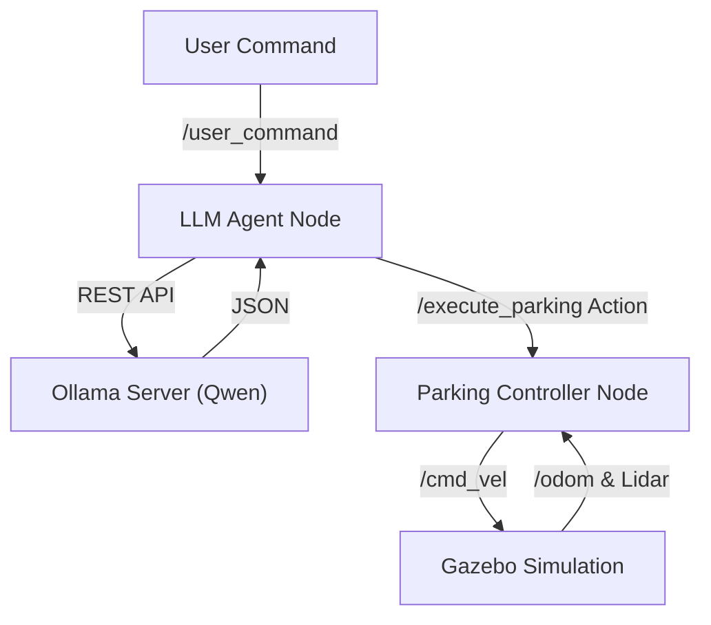

# LLM-Controlled Autonomous Parking System 🚗🤖

An autonomous parking system for an Ackermann-steered vehicle in Gazebo Fortress (Ignition), controlled by a local Large Language Model (Qwen/Ollama) via natural language commands.

  

## 🌟 Features
- **Natural Language Control**: "Park between the cars" or "Reverse into the spot".
- **Local LLM Integration**: Uses Ollama (Qwen2.5-VL/Llama3) for offline, private command processing.
- **Physics-Based Simulation**: Accurate Ackermann steering physics in Gazebo Fortress.
- **Autonomous Maneuvers**:
  - Parallel Parking 🅿️
  - Perpendicular Parking
  - Reverse Parking
  - Simple Navigation
- **Architecture**: Modular design with separate LLM Agent and Parking Controller nodes.

---

## 🏗️ Architecture



---

## 📋 Prerequisites

- **OS**: Linux (Ubuntu 22.04 / Fedora 39+)
- **ROS 2**: Humble Hawksbill
- **Simulator**: Gazebo Fortress (Ignition)
- **AI**: [Ollama](https://ollama.com/) installed on host
- **GPU**: NVIDIA RTX (Recommended for simulation & LLM)

### Dependencies
```bash
sudo apt install ros-humble-ros-gz-sim ros-humble-ros-gz-bridge
pip install requests
```

---

## 🚀 Installation

1. **Clone the repository**
   ```bash
   mkdir -p ackermann_llm_ws/src
   cd ackermann_llm_ws/src
   git clone https://github.com/YOUR_USERNAME/ackermann_llm_parking.git .
   ```

2. **Build the workspace**
   ```bash
   cd ..
   colcon build --symlink-install
   source install/setup.bash
   ```

3. **Install & Pull LLM Model**
   ```bash
   # On your host machine
   ollama pull qwen:latest
   ```

---

## 🏃 Usage

### 1. Start Ollama (on Host)
Make sure Ollama is running and accessible:
```bash
OLLAMA_HOST=0.0.0.0 ollama serve
```

### 2. Launch Simulation
```bash
# Inside your ROS 2 environment
./run_demo.sh
```
*Wait for Gazebo to open and the car to spawn.*

### 3. Send a Command
Open a new terminal and run:
```bash
./send_command.sh
```
*Default command: "Parallel park between the cars"*

Or manually:
```bash
ros2 topic pub --once /user_command std_msgs/msg/String "{data: 'Park perpendicular in the first spot'}"
```

---

## 🛠️ Configuration

### Adapting to Your Network
If running inside a container (Docker/Distrobox), edit `run_demo.sh` to set your host IP:
```bash
HOST_IP="YOUR.HOST.IP.ADDRESS"
```

### Tuning Parking physics
Edit `src/parking_controller/parking_controller/parking_controller_node.py` to adjust:
- `LINEAR_SPEED`: Max speed (default: 2.0 m/s)
- `POSITION_TOLERANCE`: Accuracy threshold (default: 1.0 m)

---

## 📂 Project Structure
- `llm_agent/`: ROS 2 node handling text-to-JSON logic via Ollama.
- `parking_controller/`: Action server executing geometric parking algorithms.
- `vehicle_description/`: URDF/Xacro models with Ignition plugins.
- `vehicle_gazebo/`: World files and launch configurations.

---

## 🤝 Contributing
Pull requests are welcome! Please ensure any physics changes are tested in the standard `parking_lot.world`.
Made in colaboration with @Ayush737648


